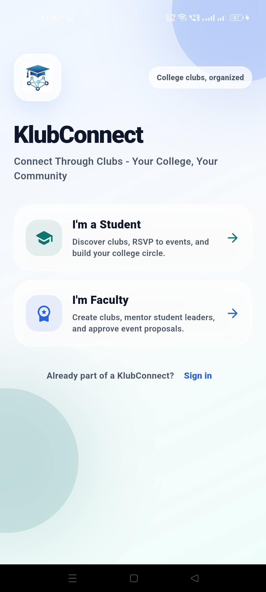
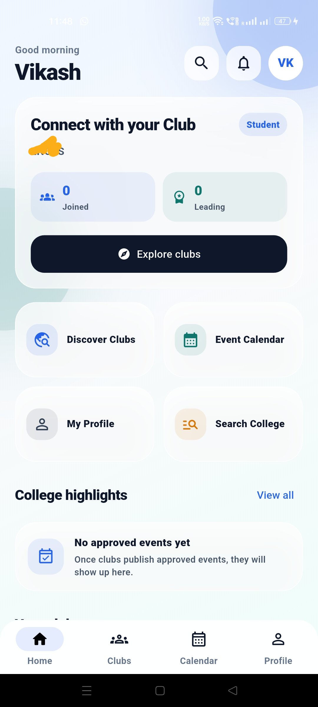
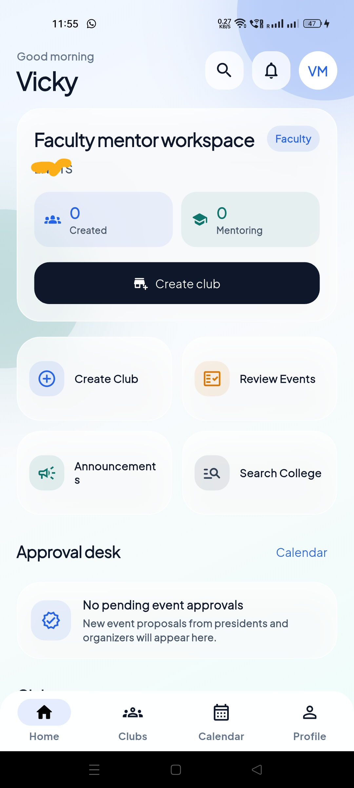

  

<h1 align="center"> KlubConnect
</h1>

  <strong> "Connect Through Clubs - Your College, Your Community" </strong>

KlubConnect is a professional college club management and social networking platform built with Flutter and Firebase. It is designed to provide a seamless experience for students to engage in college life and for faculty to oversee and mentor college organizations.

---

## App Preview

  
  
  

---

## Key Features

### **Unified Authentication & Onboarding**
- **Multi-Role Support**: Distinct registration and dashboards for **Students** and **Faculty**.
- **Secure Auth**: Robust Email/Password authentication via Firebase Auth.
- **Streamlined Onboarding**: Direct profile setup post-registration with a simplified flow for Faculty (no enrollment required).
- **Profile Customization**: Personalize profiles with photos, bios, and academic details in a clean, professional settings hub.

### **Club Management Ecosystem**
- **Discover & Join**: Browse college-specific clubs with category filters (Technical, Cultural, Sports, etc.).
- **Role-Based Governance**: Dedicated controls for **Club Masters** (Faculty), **Presidents**, and **Organizers**.
- **Membership Workflow**: Transparent join request and approval system.
- **Member Directory**: View and connect with fellow club members.

### **Dynamic Event Management**
- **Lifecycle Management**: From proposal (by Organizers/Presidents) to approval (by Club Masters).
- **Interactive RSVP**: Real-time participant tracking with "Attending", "Interested", and "Not Going" options.
- **Automated Calendars**: Centralized monthly/weekly views of all approved college events.
- **Banner Support**: High-quality event banners hosted on Firebase Storage.

### **Communication & Engagement**
- **Announcements**: Pin and broadcast important club news and updates.
- **Real-time Notifications**: Instant alerts for event approvals, membership updates, and club activities.
- **Search**: Find clubs, events, and users across the college community.

### **Professional User Experience**
- **Modern UI**: A clean, high-utility design language with a focus on professional networking.
- **Mature Palette**: Sophisticated Slate, White, and Blue color scheme.
- **Responsive Layouts**: Optimized for a smooth experience on both Android and Windows.
- **Real-time Sync**: Live updates across the app using Firestore Snapshots.

---

## Tech Stack

- **Frontend Framework**: [Flutter](https://flutter.dev) (Dart)
- **Backend Services**: [Firebase](https://firebase.google.com)
  - **Authentication**: Secure identity management.
  - **Cloud Firestore**: Real-time NoSQL database for users, clubs, and events.
  - **Cloud Storage**: Secure hosting for profile images and event banners.
  - **Cloud Messaging (FCM)**: Reliable push notification delivery (Mobile).
- **State Management**: [Provider](https://pub.dev/packages/provider)
  - *Used for decoupled, reactive state updates across the app (Auth, UI states).*
- **Architecture**: Service-Oriented (separated Services, Models, and UI layers).
- **Design System**: Professional Corporate Aesthetic with Inter typography.

---

## Security & Privacy
- **RBAC**: Strict Role-Based Access Control enforced at both the UI and Firestore Rule levels.
- **Data Integrity**: Multi-step event approval workflows to ensure college-appropriate content.
- **Privacy Controls**: Users control visibility of sensitive academic information.

---

## License
This project is licensed under the [MIT License](LICENSE).
